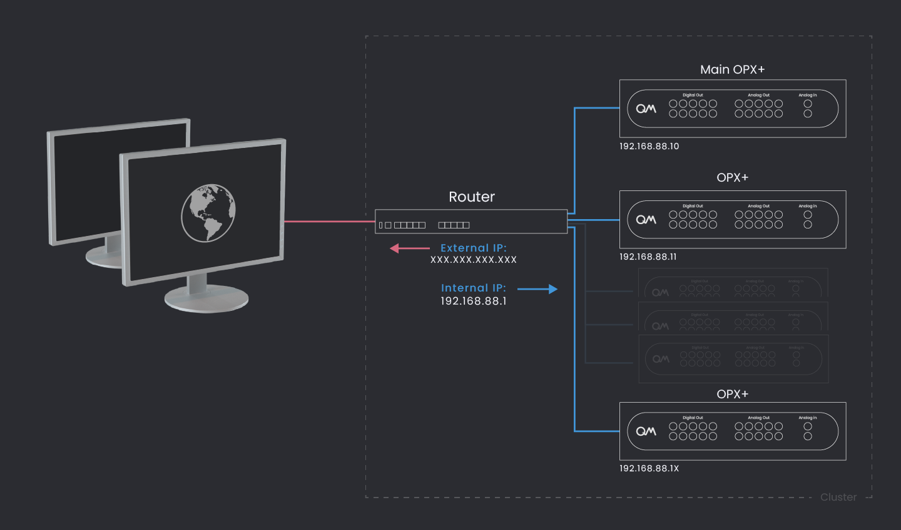

=======================
OPX+ Installation Guide
=======================

The following page describes the installation procedure of a single OPX+ or a multi-OPX+ with an OPT topology.
It covers network configuration, OPX+ connectivity, rack scheme and more.

.. contents:: :local:

Network Overview
----------------

The OPX+ controllers use an external router for network access. The communication is done via the external IP of the router,
and the OPX+ controllers are preconfigured in the router's internal network. We call this configuration a *cluster*.
Each cluster is composed of a *main* OPX+ controller, an OPT, and other OPX+ controllers.
The cluster is created and configured using the QMApp desktop.

Installation Prerequisites
--------------------------

Prior to the installation procedure, follow these prerequisites:

- If your local network requires whitelisting MAC address, make sure you whitelist the router's MAC address. If you don't know the address, follow the guide below or contact your QM representative.
- If your local network requires the use of a static IP make sure that you know which one to use.

Installation Procedure
----------------------

#. Verify you have all of the :ref:`required components<Hardware/opx+installation:Required components>`.
#. Connect the router to the external network on the 1st port, marked as “PoE In”. If necessary, connect the router to the provided power supply.
#. If the external IP to the router needs to be static, :ref:`configure the router to a static IP<Hardware/opx+installation:Configuring the router to static IP>`.
#. Mount the system:

    * **Single-OPX+ System** - Mount the OPX+ and the router in a rack or on a shelf.
    * **Multi-OPX+ System** - Place the OPX+ controllers and the OPT in the rack according to the :ref:`rack scheme<Hardware/opx+installation:Rack Scheme>`.
#. Connect the system:

    * **Single-OPX+ System**

        a. Connect the OPX+ to the power.
        b. Optional: Connect the OPX to an external reference clock.
        c. Connect the OPX+ to port 2 of the router.

    * **Single-OPX+ with Octave System**

        a. Connect the OPX+ clock input to the Octave clock output via an SMA cable **with a DC Block**.
        b. Optional: Connect the Octave to an external reference clock.
        c. Connect the OPX+ and octave to the power.
        d. Connect the OPX+ and octave to ports 2 & 3 of the router.

    * **Multi-OPX+ System (Up to 6 devices - OPX+es and Octaves)** - Connect the cables according to the :ref:`connectivity scheme<Hardware/opx+installation:Connectivity Scheme>`, in the following order:

        a. Connect the OPX+ and Octaves to the clock distributed from the OPT via an SMA cable **with a DC Block**.
        b. Connect the USB from the OPT to any USB port of the *main* OPX+.
        c. Optional: Connect the OPT to an external reference clock.
        d. Connect the OPX+ controllers via a SMA cable **with a DC block** to form a chain, connecting AUX 2 from one controller to another controller's AUX 3.
        e. Connect the optical cables used for data sharing between controllers. Remove the connectors' protectors if present.
        f. Connect the OPX+ and Octaves to the router via the ethernet cables, starting from port 2 onwards.
        g. Connect the OPX+, Octaves and the OPT to the power outlet.

    * **Multi-OPX+ System (More than 6 devices - OPX+es and Octaves)**

        a. Use one OPT as a main OPT, connecting all other OPTs' *Clk In* to the main OPT clock outputs.
        b. Connect the USB from the *main* OPT to any USB port of the *main* OPX+.
        c. Connect the USB from the other OPTs to any USB port of other OPX+es.
        d. Optional: Connect the *main* OPT to an external reference clock.
        e. Connect the OPX+ and Octaves to the clock distributed from the OPTs via an SMA cable **with a DC Block**.
        f. Connect the OPX+ controllers via a SMA cable **with a DC block** to form a chain, connecting AUX 2 from one controller to another controller's AUX 3.
        g. Connect the optical cables used for data sharing between controllers. Remove the connectors' protectors if present.
        h. Connect the OPX+ and Octaves to the router via the ethernet cables, starting from port 2 onwards.
        i. Connect the OPX+, Octaves and the OPTes to the power outlet.
#. Turn on all of the devices.
#. The system will now start calibrations, the booting sequence should take a few minutes.
#. Install the latest Python package by typing ``pip install --upgrade qm-qua`` in the desired Python environment.
#. Verify that the connection to the server has been established by running the following commands:

    .. code-block:: python

        from qm.QuantumMachinesManager import QuantumMachinesManager
        QuantumMachinesManager(host='xxx.xxx.xxx.xxx', port='80')  # enter the router's external IP in the host field

    You should see the message ``qm - INFO - Health check passed`` in the console.

Extra Topics
------------

Required components
"""""""""""""""""""

.. collapse:: Show/Hide

    |br|
    To ensure a smooth installation, please make sure you have the following components:

    .. csv-table:: List of Components
       :file: multi_OPX+_installation_components.csv
       :widths: 30,30,30
       :header-rows: 1

|br|

Rack Scheme
"""""""""""

.. collapse:: Show/Hide

    |br|
    The system fits a standard 19" rack. The sizes of the controllers are shown in the image below.
    The controllers can be mounted to the the rack with the supplied adaptors or stacked on a shelf. The router can be
    rack-mounted at the back of the rack or simply stacked.
    For a system of more than 2 OPX+ controllers, it is recommended to place the OPT in the center of the stack, such
    that equal-length cables will reach all controllers.

    The image below demonstrates the preferable OPX+ controllers and OPT placement for a system of 4 controllers.

    .. image:: Rack_Scheme.png
        :width: 800 px

|br|

Connectivity Scheme
"""""""""""""""""""

.. collapse:: Show/Hide

    |br|
    The multi OPX+ system has four required connectivity groups. Clock & sync, Inter-controller communication, Network and Power

    .. collapse:: Clock & sync

        |br|
        The clock signal is distributed by the OPT with an SMA cable per controller.
        An inner/outer DC block is optional and can be added to reduce ground loops.
        In addition, the main OPX+ of the cluster connects to the OPT via USB, to any of the 2 USB ports of the OPX+.

        A sync signal is passed between the controllers via SMA cables between the AUX ports. The connectivity should alternate
        between AUX1 (1.8V) to AUX1 (1.8V), and AUX2 (1.8V) to AUX2 (1.8V), as seen in the picture.
        An inner/outer DC block (supplied) is required to avoid potential damage to the devices and to reduce ground loops.

        .. image:: clock_sync.png
            :width: 800 px

        .. note::

            In some back panels the label are different. AUX1 is AUX2, and AUX2 is AUX3. The location of the port is the same as in the picture above.

    .. collapse:: Inter-controller Optical Connectivity Scheme

        |br|
        Data transfer and communication between controllers is operated via optical cables in an `all-to-all` connectivity.
        Each OPX+ has 12 optical ports and the preferred connectivity configuration differ with the number of
        controllers, as shown in the animations below.

        Click on each configuration to see the preferred connectivity scheme.

        .. collapse:: 2 OPX+

            .. image:: 2devices.png
                :width: 800 px

            |br|

        .. collapse:: 3 OPX+

            .. image:: 3-devices-animation.gif
                :width: 800 px

            |br|

        .. collapse:: 4 OPX+

            .. image:: 4-devices-animation.gif
                :width: 800 px

            |br|

        .. collapse:: 5 OPX+

            .. image:: 5-devices-animation.gif
                :width: 800 px

            |br|

        .. collapse:: 6 OPX+

            .. image:: 6-devices-animation.gif
                :width: 800 px

|br|

Configuring the router to static IP
"""""""""""""""""""""""""""""""""""

.. collapse:: Show/Hide

    |br|
    If static IP is needed for your system, follow these steps:

    1. Connect a computer to the router (to any port 2-10).
    2. Connect through the browser to `http://192.168.88.1` (Default gateway, the IP can be checked by typing `ifconfig` in a command prompt)
    3. Click cancel in the change password dialog.
    4. Click **"Quick Set"** at the top banner.
    5. Set up the Static IP:

    .. image:: staticIP.png

    6. Click **"apply configuration"** to save changes.
    7. Disconnect the computer from the router.

    .. note::
        The router's IP and MAC addresses can also be seen on this page.

|br|

View the router's IP and MAC addresses
""""""""""""""""""""""""""""""""""""""

.. collapse:: Show/Hide

    |br|

    Use the touch screen on the router's front panel to view information and optional configuration. At any stage you
    can click back and return to the previous screen.

    1. Click on **"Interfaces"** once

    2. Click on **"ether1"**

    3. To view the IP address press **"Addresses"** and to view the MAC address press **"Info"**

|br|

.. |br| raw:: html

    
